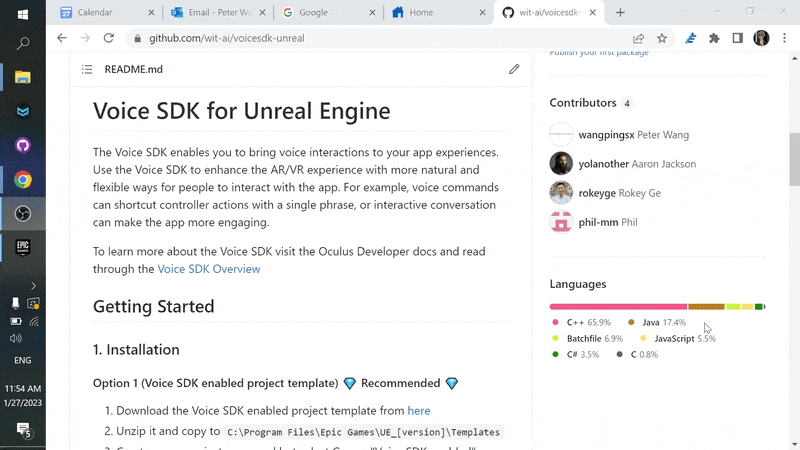
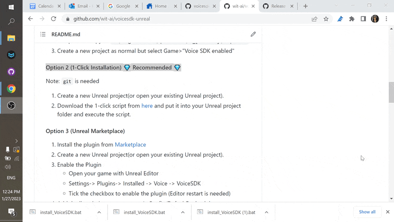
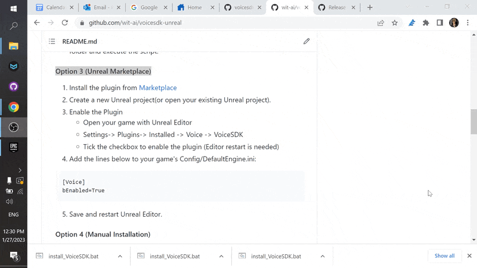

# Voice SDK for Unreal Engine
The Voice SDK enables you to bring voice interactions to your app experiences. Use the Voice SDK to enhance the AR/VR experience with more natural and flexible ways for people to interact with the app. For example, voice commands can shortcut controller actions with a single phrase, or interactive conversation can make the app more engaging.

To learn more about the Voice SDK visit the Oculus Developer docs and read through the [Voice SDK Overview](https://developer.oculus.com/documentation/unreal/vsdk-overview/)

Last but not the least, please see what voice enabled experiences that developers have been building with Voice SDK for more inspiration, [Video](https://youtu.be/afVWl5Mfn3g?list=PLb0IAmt7-GS0ewY4fQBij5X_LvS5Wc4kv&t=58) and we are so pleased to invite you to watch Unreal Voice SDK on Meta Connect 2022. [Video](https://youtu.be/afVWl5Mfn3g?list=PLb0IAmt7-GS0ewY4fQBij5X_LvS5Wc4kv&t=372)


## Features:
 - Voice Command with free ASR (Automatic Speech Recognition), NLU (Natural Language Understanding).
 - TTS (Text To Speech) with ability to live stream audio and queue requests
 - Dictation

## Getting Started
### 1. Installation

#### Option 1 (Voice SDK enabled project template) :gem: Recommended :gem:
1. Download the Voice SDK enabled project template from [here](https://github.com/wit-ai/voicesdk-unreal/releases/latest/download/TP_VoiceSDK.zip).
2. Unzip it and copy to `C:\Program Files\Epic Games\UE_[version]\Templates`.
3. Create a new project as normal but select Game>"Voice SDK enabled".

    

#### Option 2 (1-Click Installation) :gem: Recommended :gem:
**Note:** [git](https://git-scm.com/download/win) is needed.

1. Create a new Unreal project(or open your existing Unreal project).
2. Download the 1-click script from [here](https://github.com/wit-ai/voicesdk-unreal/releases/download/v49.0.1/install_VoiceSDK.bat) and put it into your Unreal project folder and execute the script.

    

#### Option 3 (Unreal Marketplace)
1. Install the plugin from [Marketplace](https://www.unrealengine.com/marketplace/en-US/product/voice-sdk).
2. Create a new Unreal project(or open your existing Unreal project).
3. Enable the Plugin.
   - Open your game with Unreal Editor.
   - Settings-> Plugins-> Installed -> Voice -> VoiceSDK.
   - Tick the checkbox to enable the plugin (Editor restart is needed).
4. Add the lines below to your game's Config/DefaultEngine.ini:
```
[Voice]
bEnabled=True
```
5. Save and restart Unreal Editor.

    

#### Option 4 (Manual Installation)
1. Create a new Unreal project(or use your existing Unreal project).
2. Grab the latest release zip from [Releases](https://github.com/wit-ai/voicesdk-unreal/releases/)
3. Extract the zip in your game's `Plugins` directory.
4. Add the lines below to your game's Config/DefaultEngine.ini:
```
[Voice]
bEnabled=True
```

## 2. Creating an app on Wit.ai
Voice SDK is powered by the Wit.ai Natural Language Understanding (NLU) service, Please follow this [quick start guide](https://wit.ai/docs/quickstart) to create a new Wit app.

## 3. Setting up your Wit Configuration file in Unreal
- In Wit.ai, go to Management > Settings and copy the Server Access Token.
- In Unreal Editor go to Menu-> Oculus-> Configuration Editor-> Input a Config file name, paste the copied Server Access Token and-> Click `Create`

## 4. Sample Game
If you have done the above steps, Congratulations! You have VoiceSDK integrated with your game! You can now start to build voice experiences into your game. But we highly recommend you checkout our [sample project](https://github.com/wit-ai/voicesdk-unreal-samples) first. It demonstrates all Voice SDK features and best practices.

## Troubleshooting
### Marketplace Voice SDK v47.0.3 doesn't have Presets to run TTS
The TTS Speaker won't work without Presets. However since Marketplace doesn't allow plugins to contain content you will need to download the additional content from [here](https://github.com/wit-ai/wit-unreal/tree/47.0.3/Content/Presets).

## Documentation
* [Voice SDK Online Documentation](https://developer.oculus.com/documentation/unreal/vsdk-overview/)
* [Wit.ai Documentation](https://wit.ai/docs)
    * Voice SDK uses Wit.ai to power its speech recognition, text to speech, and natural language functionality. To learn more about Wit.ai check out the Wit.ai Documentation.

## License
The license for `voicesdk-unreal` can be found in [LICENSE](https://github.com/wit-ai/voicesdk-unreal/blob/main/LICENSE) file in the root directory of this source tree.

You can also find the applicable Oculus License here: https://developer.oculus.com/licenses/oculussdk

The MIT license applies to only certain, clearly marked documents. If an individual file does not indicate which license it is subject to, then the Oculus License applies.

## Terms of Use
Our terms of use can be found at https://opensource.facebook.com/legal/terms.

Use of Wit.ai services fall under the terms of use of Wit.ai found here: https://wit.ai/terms.

## Privacy Policy
Our privacy policy can be found at https://opensource.facebook.com/legal/privacy.

The privacy policy for the Wit.ai service can be found at https://wit.ai/privacy.

Please see the Voice SDK Overview for additional applicable terms and policies.

https://developer.oculus.com/documentation/unreal/vsdk-overview/
